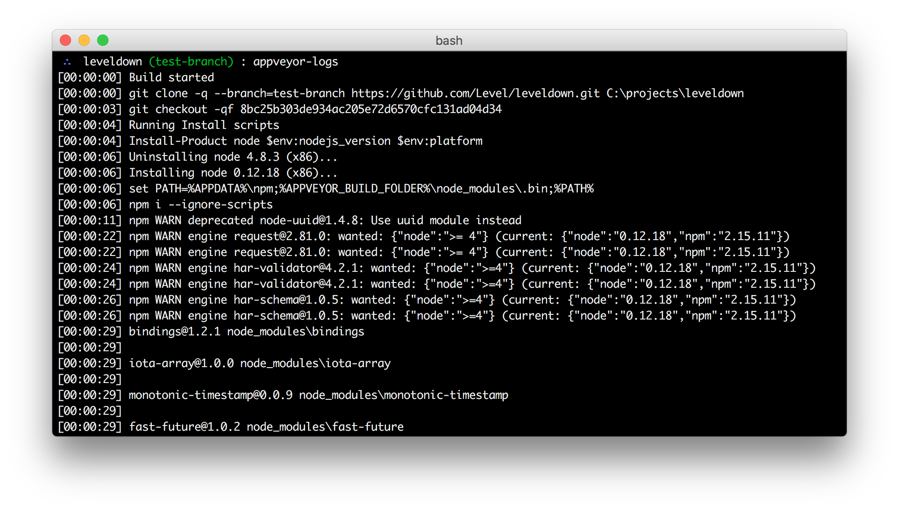
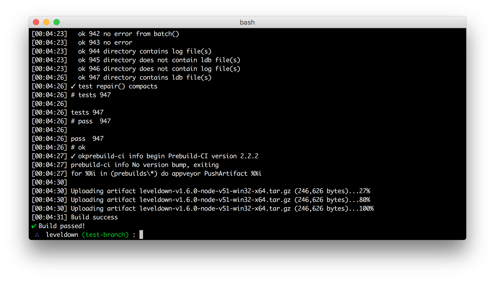

# appveyor-logs [](https://appveyor-ci.org/juliangruber/appveyor-logs)

Stream all available appveyor logs of the current repository's current commit to the terminal, until all jobs are finished!





## Usage

```bash
$ cd ~/dev/level/leveldown
$ appveyor-logs

$ # or

$ appveyor-logs ~/dev/level/leveldown
```

## Installation

```bash
$ npm install -g appveyor-logs
```

## JS API

```js
const logs = require('appveyor-logs')

logs('.')
  .on('job', stream => {
    stream.pipe(process.stdout, { end: false })
  })
  .on('pass', () => {
    process.exit(0)
  })
  .on('fail', () => {
    process.exit(1)
  })
```

For more events, check out [bin.js](https://github.com/juliangruber/appveyor-logs/blob/master/bin.js).

## Related projects

- __[travis-logs](https://github.com/juliangruber/travis-logs)__ &mdash; Stream travis logs to your terminal!
- __[travis-watch](https://github.com/juliangruber/travis-watch)__ &mdash; Stream live Travis test results of the current commit to your terminal!
- __[appveyor-watch](https://github.com/juliangruber/appveyor-watch)__ &mdash; Stream live AppVeyor test results of the current commit to your terminal!
- __[ci-watch](https://github.com/juliangruber/ci-watch)__ &mdash; Travis-Watch and AppVeyor-Watch combined!
- __[travis-log-stream](https://github.com/juliangruber/travis-log-stream)__ &mdash; Read streaming travis logs, no matter if live or historic.

## License

MIT


